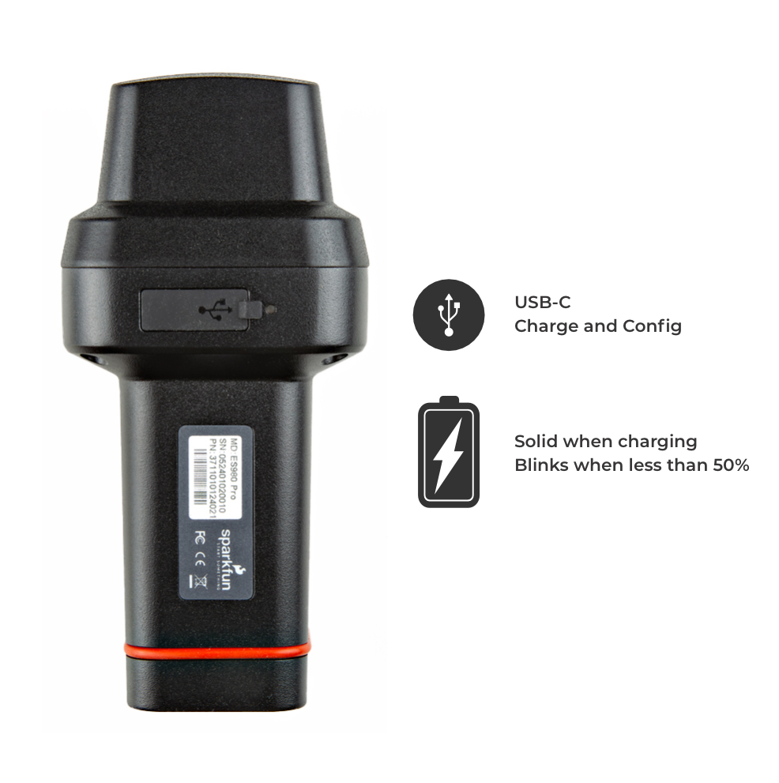
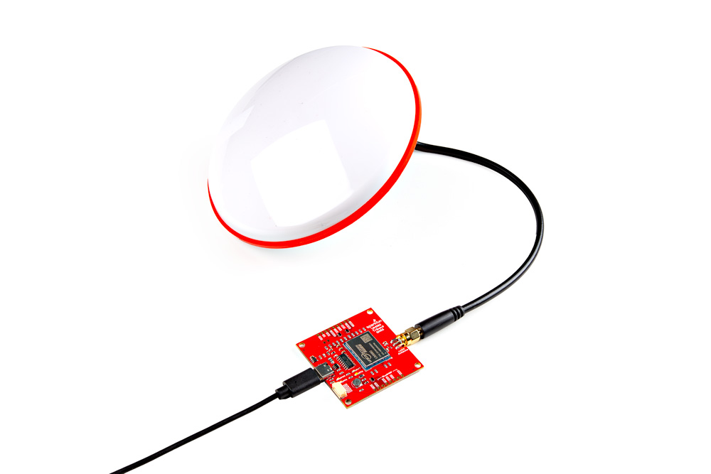

To update firmware, you will need to connect to the UM980's serial UART1 port. Make sure to check the design files and hookup guide since the design can vary between products. Below are a few examples.

### SparkFun RTK Torch

For the SparkFun RTK Torch, you will need a serial passthrough via the ESP32. First, power the unit and connect a USB cable to its USB port. We do not have to worry about attaching a multi-band L1/L2/L5 antenna since there is one already built in.

  <table>
    <tr style="vertical-align:middle;">
     <td style="text-align: center; vertical-align: middle;"></td>
    </tr>
  </table>

Open a [serial terminal window set to **115200** baud](https://learn.sparkfun.com/tutorials/terminal-basics/arduino-serial-monitor-windows-mac-linux). Then put the device into serial passthrough mode. From the main menu, navigate to: System <kbd>s</kbd> > Hardware <kbd>h</kbd> > UM980 Direct Connect <kbd>13</kbd>. This will put the device into a passthrough mode, but with special character monitoring that allows the UM980 to be reset when bootloading is detected. Close the terminal connection so that UPrecise can connect to the COM port.

!!! note
    Some terminals cause the ESP32 to reset when closing the port. This reset causes the UM980 pass-through mode to exit. TeraTerm is known to cause this issue. To enter pass-through mode we recommend using the Arduino Serial Monitor.

### SparkFun UM980 Triband GNSS RTK Breakout

On the SparkFun UM980 Triband GNSS RTK Breakout Board, you will need to connect a USB cable between your computer and the breakout board. Then connect a multi-band L1/L2/L5 antenna to the SMA connector.

  <table>
    <tr style="vertical-align:middle;">
     <td style="text-align: center; vertical-align: middle;"></td>
    </tr>
  </table>

