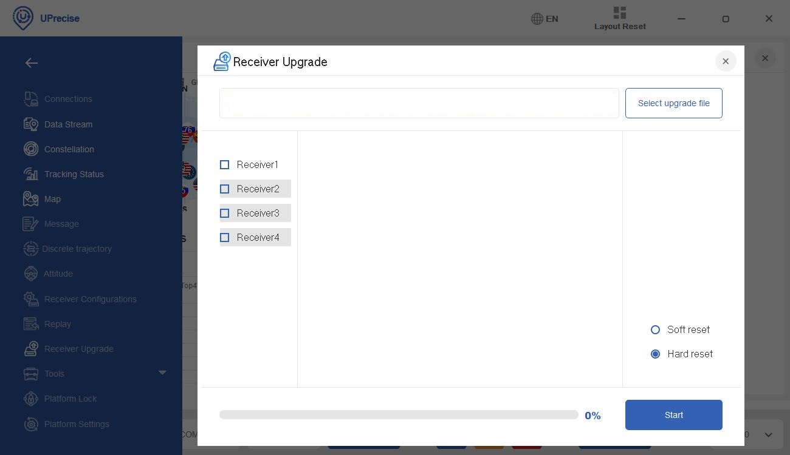

Over time, manufacturers will provide firmware updates running on GNSS receivers.

  <table>
    <tr style="vertical-align:middle;">
     <td style="text-align: center; vertical-align: middle;"></td>
    </tr>
  </table>

This tutorial will demonstrate how to upgrade the firmware on the UM980 such as the SparkFuN RTK Torch or the SparkFun Triband GNSS RTK Breakout Board. However, it can be used for Unicore GNSS Receivers as well.

<!--

* [SparkFun RTK Torch](https://www.sparkfun.com/products/25662)
* [SparkFun Triband GNSS RTK Breakout Board](https://www.sparkfun.com/products/23286)

-->

<!-- ----------WHITE SPACE BETWEEN PRODUCTS---------- -->
-   <a href="https://www.sparkfun.com/products/25662">
      <figure markdown>
        
      </figure>
    </a>

    ---

    <a href="https://www.sparkfun.com/products/25662">
      <b>SparkFun RTK Torch</b>
       
      GPS-25662
    </a>
<!-- ----------WHITE SPACE BETWEEN PRODUCTS---------- -->
-   <a href="https://www.sparkfun.com/products/23286">
      <figure markdown>
        
      </figure>
    </a>

    ---

    <a href="https://www.sparkfun.com/products/23286">
      <b>SparkFun Triband GNSS RTK Breakout - UM980</b>
       
      GPS-23286
    </a>
<!-- ----------WHITE SPACE BETWEEN PRODUCTS---------- -->

### Suggested Reading

If you aren’t familiar with the following concepts, we also recommend checking out a few of these tutorials before continuing.

<!-- ----------WHITE SPACE BETWEEN GRID CARDS---------- -->
-   <a href="https://docs.sparkfun.com/SparkFun_RTK_Torch/">
      <figure markdown>
        
      </figure>
    </a>

    ---

    <a href="https://docs.sparkfun.com/SparkFun_RTK_Torch/">
      <b>SparkFun RTK Torch Hookup Guide</b>
    </a>
<!-- ----------WHITE SPACE BETWEEN GRID CARDS---------- -->
-   <a href="https://docs.sparkfun.com/SparkFun_UM980_Triband_GNSS_RTK_Breakout/">
      <figure markdown>
        
      </figure>
    </a>

    ---

    <a href="https://docs.sparkfun.com/SparkFun_UM980_Triband_GNSS_RTK_Breakout/">
      <b>SparkFun Triband GNSS RTK Breakout - UM980 Hookup Guide</b>
    </a>
<!-- ----------WHITE SPACE BETWEEN GRID CARDS---------- -->

You may also be interested in the following blog posts on GNSS technologies.

-   <a href="https://www.sparkfun.com/news/4276">
	<figure markdown>
	
	</figure>

	---

	**GPS vs GNSS**</a>

-   <a href="https://www.sparkfun.com/news/7138">
	<figure markdown>
	
	</figure>

	---

	**What is Correction Data?**</a>

-   <a href="https://www.sparkfun.com/news/7533">
	<figure markdown>
	
	</figure>

	---

	**Real-Time Kinematics Explained**</a>

