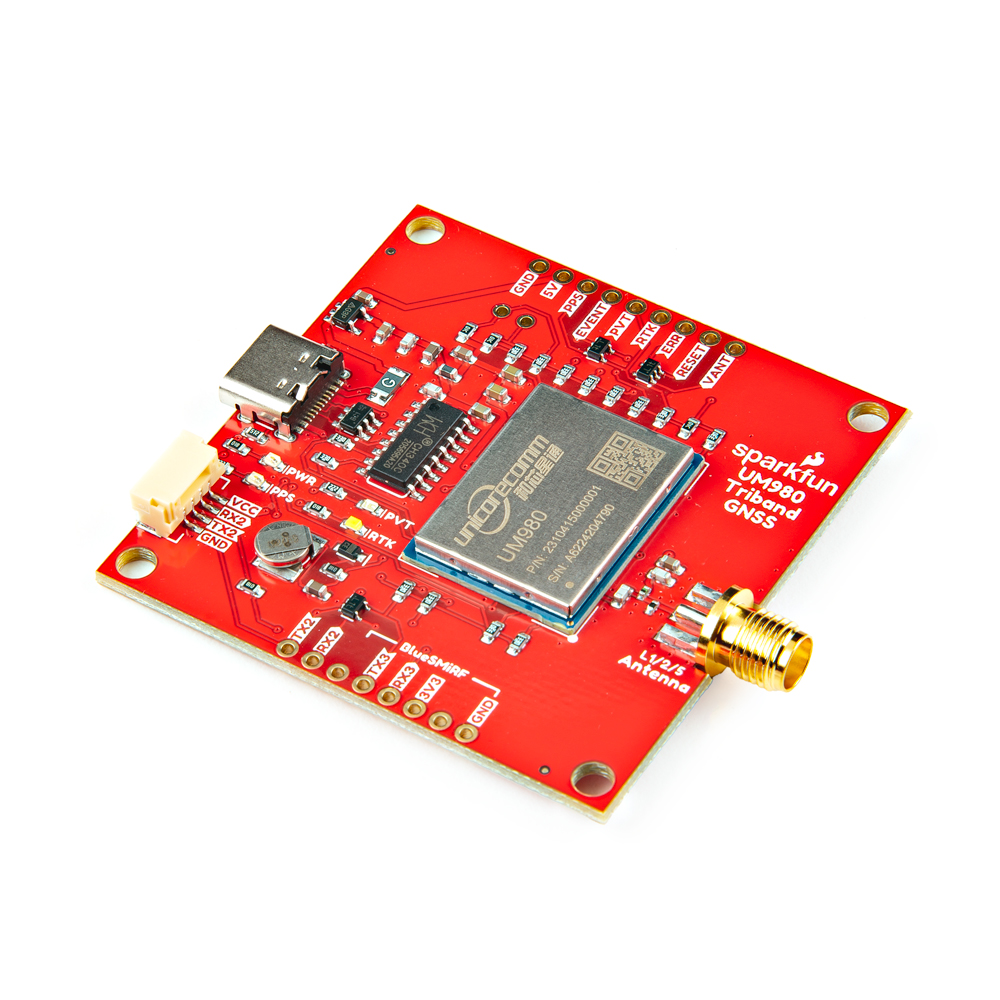

Now that you've successfully got your SparkFun TriBand GNSS RTK- Breakout - UM980 up and running, it's time to incorporate it into your own project! For more information, check out the resources below:

* Unicore Communications UM980
    * [General Specifications (PDF)](../assets/component_documentation/RX UNICORE UM980 (04-23).pdf)
    * [Datasheet (PDF)](../assets/component_documentation/UM980_Datasheet.pdf)
    * [User Manual (PDF)](../assets/component_documentation/UM980_User Manual_EN_R1.1.pdf)
    * [Reference Commands Manual (PDF)](../assets/component_documentation/Unicore_Reference_Commands_Manual_For_N4_High_Precision_Products_V2_EN_R1_1.pdf)
    * [UPrecise V2.0 (EXE)](https://en.unicore.com/uploads/file/Tool/uprecise-v2-0.exe)
    * [UPrecise User Manual (PDF)](../assets/component_documentation/uprecise-user-manual-en-r2-0.pdf)
* [CH340 Drivers](https://learn.sparkfun.com/tutorials/how-to-install-ch340-drivers)
* [SparkFun RTK](https://www.sparkfun.com/rtk)

Or check out some of these tutorials using the UM980!

<!-- ----------WHITE SPACE BETWEEN GRID CARDS---------- -->
-   <a href="https://docs.sparkfun.com/SparkFun_RTK_Everywhere_Firmware/">
      <figure markdown>
        
      </figure>
    </a>

    ---

    <a href="https://docs.sparkfun.com/SparkFun_RTK_Everywhere_Firmware/">
      <b>SparkFun RTK Everywhere Product Manual</b>
    </a>
<!-- ----------WHITE SPACE BETWEEN GRID CARDS---------- -->
-   <a href="https://docs.sparkfun.com/SparkFun_UM980_Triband_GNSS_RTK_Breakout/">
      <figure markdown>
        
      </figure>
    </a>

    ---

    <a href="https://docs.sparkfun.com/SparkFun_UM980_Triband_GNSS_RTK_Breakout/">
      <b>SparkFun Triband GNSS RTK Breakout - UM980 Hookup Guide</b>
    </a>
<!-- ----------WHITE SPACE BETWEEN GRID CARDS---------- -->

